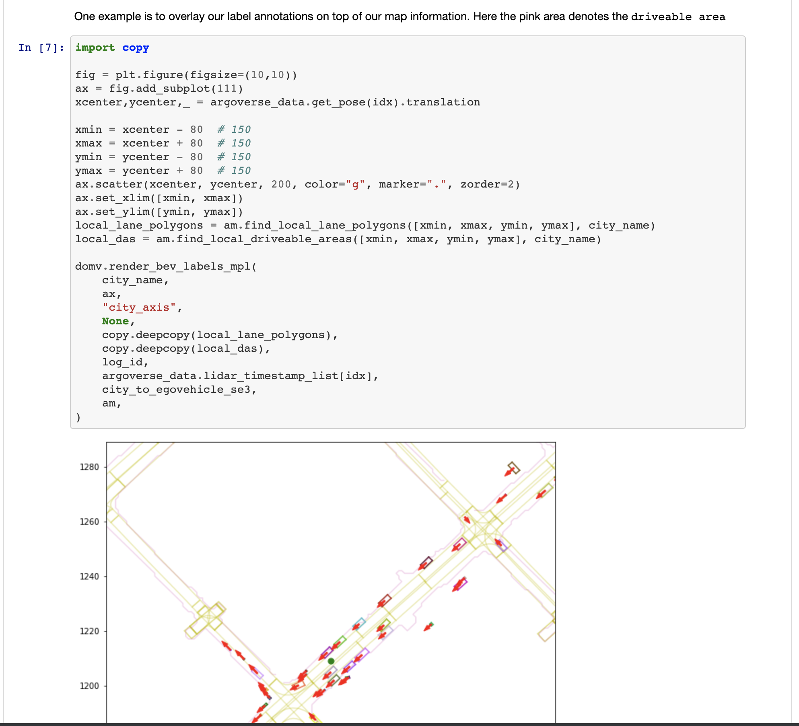
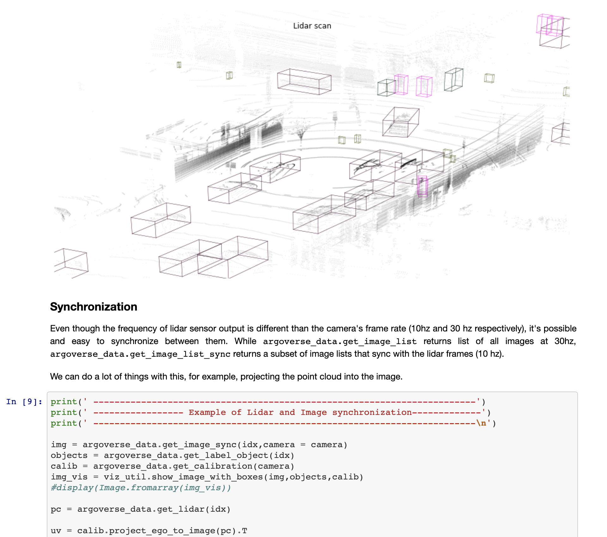
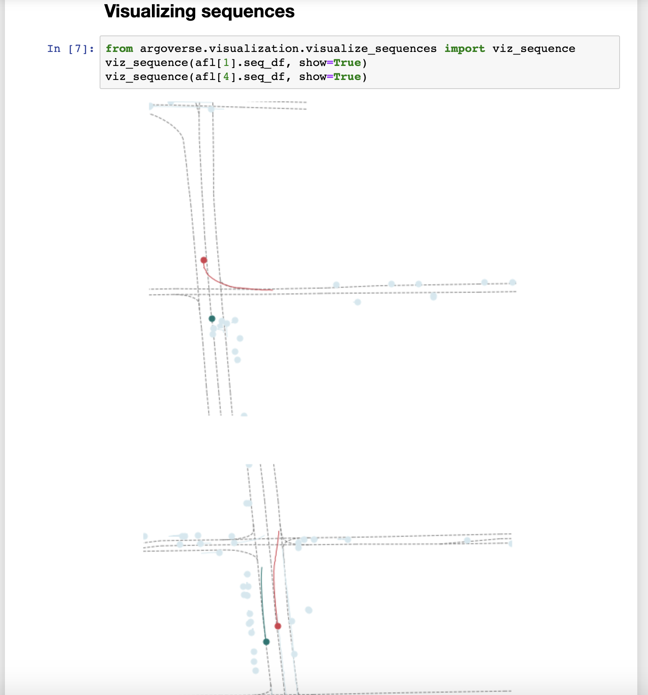
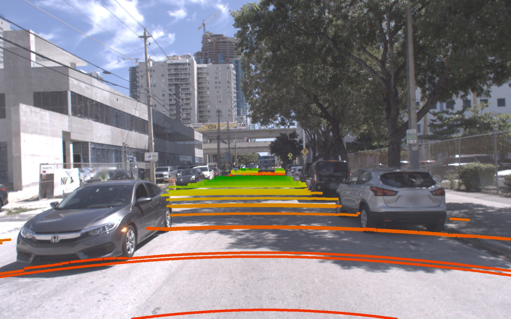

[](https://www.python.org/downloads/release/python-370/)
[](https://www.python.org/downloads/release/python-380/)
[](./LICENSE)


> ### [Argoverse 2 API](https://github.com/argoai/av2-api) has been released! Check out our [NeurIPS 2021 Datasets and Benchmarks publication](https://datasets-benchmarks-proceedings.neurips.cc/paper/2021/hash/4734ba6f3de83d861c3176a6273cac6d-Abstract-round2.html) to learn more about the datasets.

---

# Argoverse API

> Official GitHub repository for [Argoverse dataset](https://www.argoverse.org)

---

## Table of Contents

> If you have any questions, feel free to open a [GitHub issue](https://github.com/argoai/argoverse-api/issues) describing the problem.

- [Installation](#installation)
- [Usage](#usage)
- [Demo](#demo)
- [Baselines](#baselines)
- [Contributing](#contributing)
- [Disclaimer](#disclaimer)
- [License](#license)
- [Open-Source Libraries Using Argoverse](#other-repos)


---

## Installation

- Linux
- MacOS

### 1) Clone

- Clone this repo to your local machine using:
```git clone https://github.com/argoai/argoverse-api.git```

### 2) Download HD map data

- Download `hd_maps.tar.gz` from [our website](https://www.argoverse.org/av1.html#download-link) and extract into the root directory of the repo. Your directory structure should look something like this:

```
argodataset
└── argoverse
    └── data_loading
    └── evaluation
    └── map_representation
    └── utils
    └── visualization
└── map_files
└── license
...
```

### 3) Download Argoverse-Tracking and Argoverse-Forecasting

We provide both the full dataset and the sample version of the dataset for testing purposes. Head to [our website](https://www.argoverse.org/data.html#download-link) to see the download option.

* **Argoverse-Tracking** provides track annotations, egovehicle poses, and *undistorted*, raw data from camera (@30hz) and lidar sensors (@10hz) as well as two stereo cameras (@5hz). We've released a total 113 scenes/logs, separated into 65 logs for training, 24 logs for validating, and 24 logs for testing. We've separated training data into smaller files to make it easier to download, but you should extract them all into one folder.
    We also provide sample data (1 log) in `tracking_sample.tar.gz`.

* **Argoverse-Forecasting** contains 327790 sequences of interesting scenarios. Each sequence follows the trajectory of the main agent for 5 seconds, while keeping track of all other actors (e.g car, pedestrian). We've separated them into 208272 training sequences, 40127 validation sequences, and 79391 test sequences.
    We also provide sample data (5 sequences) in `forecasting_sample.tar.gz`.

Note that you need to download HD map data (and extract them into project root folder) for the API to function properly. You can selectively download either **Argoverse-Tracking** or **Argoverse-Forecasting** or both, depending on what type of data you need. The data can be extracted to any location in your local machine.

### 4) Install argoverse package

* `argoverse` can be installed as a python package using

        pip install -e /path_to_root_directory_of_the_repo/

Make sure that you can run `python -c "import argoverse"` in python, and you are good to go!

### (optional) Install mayavi
* Some visualizations may require `mayavi`. See instructions on how to install Mayavi [here](https://docs.enthought.com/mayavi/mayavi/installation.html).

### (optional) Install ffmpeg
* Some visualizations may require `ffmpeg`. See instructions on how to install ffmpeg [here](https://ffmpeg.org/download.html).

### (optional) Stereo tutorial dependencies
* You will need to install three dependencies to run the [stereo tutorial](https://github.com/argoai/argoverse-api/blob/master/demo_usage/competition_stereo_tutorial.ipynb):

    * **Open3D**: See instructions on how to install [here](https://github.com/intel-isl/Open3D).
    * **OpenCV contrib**: See instructions on how to install [here](https://pypi.org/project/opencv-contrib-python).
    * **Plotly**: See instructions on how to install [here](https://github.com/plotly/plotly.py).

### (optional) Remake the object-oriented label folders
* The `track_labels_amodal` folders contains object-oriented labels (in contrast to per-frame labels in `per_sweep_annotations_amodal` folders. Run following script to remake `track_labels_amodal` folders and fix existing issues:

        python3 argoverse/utils/make_track_label_folders.py argoverse-tracking/train/

        python3 argoverse/utils/make_track_label_folders.py argoverse-tracking/val/

---

## Usage
The Argoverse API provides useful functionality to interact with the 3 main components of our dataset: the HD Map, the Argoverse Tracking Dataset and the Argoverse Forecasting Dataset.

```python
from argoverse.map_representation.map_api import ArgoverseMap
from argoverse.data_loading.argoverse_tracking_loader import ArgoverseTrackingLoader
from argoverse.data_loading.argoverse_forecasting_loader import ArgoverseForecastingLoader
avm = ArgoverseMap()
argoverse_tracker_loader = ArgoverseTrackingLoader('argoverse-tracking/')    #simply change to your local path of the data
argoverse_forecasting_loader = ArgoverseForecastingLoader('argoverse-forecasting/') #simply change to your local path of the data
```
API documentation is available [here](https://argoai.github.io/argoverse-api/). We recommend you get started by working through the demo tutorials below.

---

## Demo
To make it easier to use our API, we provide demo tutorials in the form of Jupyter Notebooks.

To run them, you'll need to first install Jupyter Notebook `pip install jupyter`. Then navigate to the repo directory and open a server with `jupyter notebook`. When you run the command, it will open your browser automatically. If you lose the page, you can click on the link in your terminal to re-open the Jupyter notebook.

Once it's running, just navigate to the `demo_usage` folder and open any tutorial! Note that to use the tracking and forecasting tutorials, you'll need to download the tracking and forecasting sample data from [our website](https://www.argoverse.org/data.html#download-link) and extract the folders into the root of the repo.

### **Argoverse Map Tutorial**
[](./demo_usage/argoverse_map_tutorial.ipynb)

### **Argoverse-Tracking Tutorial**
[](./demo_usage/argoverse_tracking_tutorial.ipynb)

### **Argoverse-Forecasting Tutorial**
[](./demo_usage/argoverse_forecasting_tutorial.ipynb)

### Rendering birds-eye-view
Run the following script to render cuboids from a birds-eye-view on the map.
```
$ python visualize_30hz_benchmark_data_on_map.py --dataset_dir <path/to/logs> --log_id <id of the specific log> --experiment_prefix <prefix of the output directory>
```
For example, the path to the logs might be `argoverse-tracking/train4` and the log id might be `2bc6a872-9979-3493-82eb-fb55407473c9`.  This script will write to `<experiment prefix>_per_log_viz/<log id>` in the current working directory with images that look like the following: 

It will also generate a video visualization at `<experiment prefix>_per_log_viz/<log id>_lidar_roi_nonground.mp4`

### Rendering cuboids on images
Run the following script to render cuboids on images.
```
$ python cuboids_to_bboxes.py --dataset-dir <path/to/logs> --log-ids <id of specific log> --experiment-prefix <prefix for output directory>
```
This script can process multiple logs if desired.  They can be passed as a comma separated list to `--log-ids`.  Images will be written to `<experiment prefix>_<log id>` in the working directory that look like the following: 

It will also generate video visualizations for each camera in `<experiment prefix>_amodal_labels/`

### Rendering ground lidar points on images
Run the following script to render lidar points corresponding to the ground surface onto images.
```
$ python visualize_ground_lidar_points.py --dataset-dir <path/to/logs> --log-ids <comma separated list of logs>  --experiment-prefix <prefix for output directory>
```
This will produce images and videos will be in the directory `<experiment prefix>_ground_viz/<log id>`.  Here is an example image: 

### Calibration and Stereo
For all log segments, accurate calibration between LiDAR and cameras enables sensor fusion approaches. In version 1.1 of Argoverse, we improved the stereo calibration significantly, as well.

---
## A Note Regarding Coordinate Transforms
We provide a number of SE(3) and SE(2) coordinate transforms in the raw Argoverse data. The main notation we use is:

`p_dst = dst_SE3_src * p_src` or `p_dst = dst_SE2_src * p_src`.
We'll describe the 6-dof transforms in more detail below:

- **Map pose**: represents the location and orientation of the ego-vehicle inside the city (i.e. map) reference frame, `city_SE3_egovehicle`. We provide map pose for each log in `poses/city_SE3_egovehicle_{nanosec_timestamp}.json`. This transform brings a point in the egovehicle's reference frame into the city's reference frame.
- **Camera extrinsics**: for each camera sensor, a variable named `egovehicle_SE3_camera` can be found in our log calibration files `vehicle_calibration_info.json`. When we [form the extrinsics matrix](https://github.com/argoai/argoverse-api/blob/master/argoverse/utils/calibration.py#L265) in our API, we use its inverse, `camera_SE3_egovehicle`, i.e. to bring points *into* the camera coordinate frame before perspective projection.
- **Object labels**: an `egovehicle_SE3_object` transformation is provided for each annotated cuboid, that takes points from the labeled object's reference frame (located at the object centroid), to the egovehicle's reference frame. This data is provided per LiDAR sweep at `per_sweep_annotations_amodal/tracked_object_labels_{nanosec_timestamp}.json`.

Note that for convenience, the LiDAR point cloud sweep data is provided *directly in the ego-vehicle's coordinate frame*, rather than in either of the LiDAR sensor frames. The ego-vehicle's reference frame is placed at the center of the rear axle (see Figure 3 of our [paper](https://arxiv.org/pdf/1911.02620.pdf), with "x" pointing forward, "z" pointing up, and "y" pointing to the left).

A simple example for understanding the *object labels* -- imagine the ego-vehicle is stopped at a 4-way intersection at a red light, and an object is going straight through the intersection with a green light, moving from left to right in front of us. If that labeled object is instantaneously 4 meters ahead of the egovehicle (+4 m along the x-axis), then the annotation would include the rotation to align the labeled object with the egovehicle's x-axis. Since we use the right-hand rule, we need a 90 degree rotation about the "z"-axis to align the object's x-axis with the egovehicle's x-axis. If (0,0,0) is the origin of the labeled object, to move itself into the egovehicle frame, you would need to add 4 to its x coordinate, thus adding the translation vector (4,0,0). 

**What about tracks in the forecasting dataset?** These are provided directly in the city reference frame (i.e. the map coordinate system).

---

## Baselines

We have also released the baseline codes for both 3D tracking and motion forecasting tasks. 
3D Tracking code can be found at https://github.com/alliecc/argoverse_baselinetracker and Motion Forecasting code at https://github.com/jagjeet-singh/argoverse-forecasting

---

## Contributing
Contributions are always welcome! Please be aware of our [contribution guidelines for this project](CONTRIBUTING.md).

---

## Disclaimer
Argoverse APIs are created by John Lambert, Patsorn Sangkloy, Ming-Fang Chang, and Jagjeet Singh to support "Chang, M.F. et al. (2019) Argoverse: 3D Tracking and Forecasting with Rich Maps, paper presented at The IEEE Conference on Computer Vision and Pattern Recognition (CVPR) (pp. 8748-8757). Long Beach, CA: Computer Vision Foundation." THIS SOFTWARE CODE IS INTENDED FOR RESEARCH PURPOSES ONLY AND IS NOT DESIGNATED FOR USE IN TRANSPORTATION OR FOR ANY OTHER DANGEROUS APPLICATION IN WHICH THE FAILURE OF SOFTWARE COULD CREATE A SITUATION WHERE PERSONAL INJURY OR DEATH MAY OCCUR.

---

## License

We release our API under the MIT license. We retain the Apache 2.0 license on certain files. See **[LICENSE](./LICENSE)**

## Open-Source Libraries Using Argoverse

- A nuScenes to Argoverse converter can be found at https://github.com/bhavya01/nuscenes_to_argoverse, contributed by Bhavya Bahl and John Lambert.
- A Waymo Open Dataset to Argoverse converter can be found at https://github.com/johnwlambert/waymo_to_argoverse, contributed by John Lambert and Hemanth Chittanuru.
